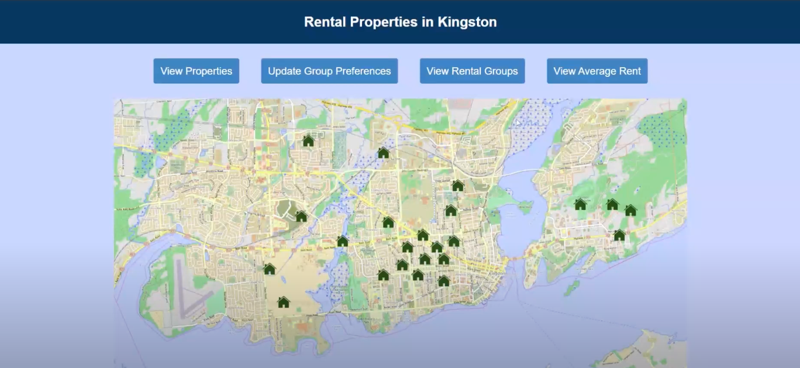

# Kingston Rental Property Database

The Kingston Rental Property Database is a web application designed to manage and display rental property listings in Kingston. It uses a MySQL database for data storage, PHP for server-side scripting, Apache as the web server, and HTML/CSS for the frontend interface.

## Demo

For a detailed walkthrough of the Kingston Rental Property Database, watch the [demo video](https://youtu.be/bHJxmLcjUco?si=hu53p3iYVH9XJce_).
